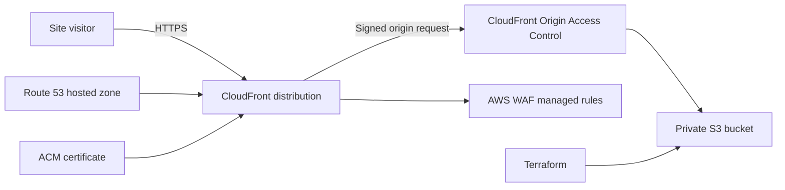

# Terraform AWS Static Site Delivery

[](https://developer.hashicorp.com/terraform)
[](https://registry.terraform.io/providers/hashicorp/aws/latest/docs)

A Terraform reference implementation for publishing a custom-domain static
website through Amazon CloudFront. It demonstrates the infrastructure pieces a
small marketing site or documentation portal needs: HTTPS, DNS validation,
edge caching, and baseline web protection.

Part of [Abel Nutsugah’s AWS infrastructure portfolio](https://github.com/bigmanabel).

## Use case

Use this project as a starting point when a static frontend needs a global URL,
a custom domain, and an infrastructure-as-code deployment path. Place built
site assets in `build/`, then Terraform provisions and synchronizes the
delivery stack.

## Architecture



## What Terraform creates

- Private S3 bucket with versioning, server-side encryption, and public access
  blocks for the site assets
- CloudFront distribution with compression and AWS-managed cache policy
- ACM certificate and Route 53 DNS validation records
- Route 53 alias record for the custom domain
- AWS WAF web ACL using the AWS managed Common Rule Set
- Declarative `aws_s3_object` resources that upload each file from `build/`
  with content types and cache-control headers

## Prerequisites

- Terraform `~> 1.7`
- AWS CLI authenticated with a profile, AWS IAM Identity Center, or environment
  credentials
- A public Route 53 hosted zone for the exact `domain_name`
- Static site files in `build/`

> **Region requirement:** CloudFront certificates and CloudFront-scope WAF
> resources are created through an explicit `us-east-1` provider alias. The S3
> bucket may use the configured `aws_region`.

## Configure and validate

Copy the example, then replace the placeholders with your values:

```bash
cp terraform.tfvars.example terraform.tfvars
terraform fmt -check -recursive
terraform init
terraform validate
terraform plan
```

```hcl
aws_region   = "us-east-1"
project_name = "example-marketing-site"
domain_name  = "example.com"
```

Apply only after reviewing the plan:

```bash
terraform apply
```

Useful outputs include the S3 bucket name, CloudFront domain, custom website
URL, ACM certificate ARN, and WAF ARN.

## Operational notes

- CloudFront, WAF, Route 53, and S3 can incur charges. Review the plan and
  current AWS pricing before applying or leaving the stack running.
- Terraform manages the files in `build/` as S3 objects. A `terraform plan`
  clearly shows every upload, update, and deletion before it reaches the bucket.
- Terraform state can contain infrastructure details. Keep state in a secured
  remote backend for team or long-lived environments, and never commit local
  state or `terraform.tfvars` files.

## Security controls

- S3 Block Public Access is enabled and bucket ownership enforcement disables
  ACL-based access.
- CloudFront accesses the S3 REST origin through Origin Access Control; the
  bucket policy permits reads only from this distribution.
- The CloudFront distribution includes the configured custom domain as an
  alternate domain name and uses the validated ACM certificate.
- The WAF uses the AWS managed Common Rule Set at the CloudFront scope.

When applying this change to an existing deployment, review the Terraform plan
carefully: it migrates the origin from a public S3 website endpoint to a private
S3 REST origin and updates the distribution configuration.

## Project layout

```text
├── build/                       # Static site assets to upload
├── main.tf                      # Root module
├── provider.tf                  # Terraform and AWS provider requirements
├── terraform.tfvars.example     # Safe configuration template
└── modules/s3-static-site/      # S3, CloudFront, ACM, Route 53, and WAF
```

## Cleanup

Run `terraform destroy` only after confirming the target AWS account and
workspace. This removes the delivery resources and the deployed site assets.
